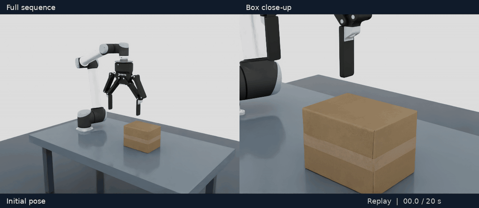
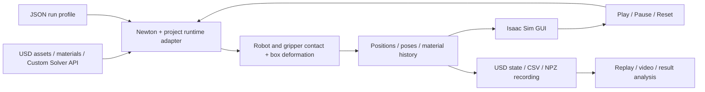
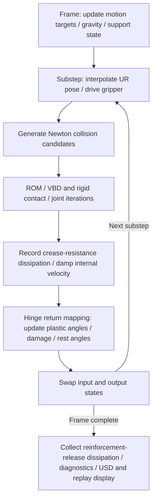

# Newton VBD Cardboard

[English](README.md) | [한국어](README_KR.md)

**Robotic vertical grasping, lifting, plastic crushing, and dropping of a cardboard box with Newton VBD and Isaac Sim**

A UR10 and a Robotiq-based gripper pick a cardboard box from a table and lift it by 200 mm while maintaining a vertical orientation. After crushing the box in midair, the gripper opens and the box falls back onto the table under gravity. Newton computes contact deformation and permanent creases, while Isaac Sim displays the robot and box states.



*Left: the complete robot motion. Right: a close-up of the box and gripper. Both Isaac Sim views synchronously replay the same 20-second simulation recording. Replay speed does not represent real-time physics throughput. [MP4 video](docs/media/vertical-pick-replay.mp4)*

| Component | Implementation |
| --- | --- |
| Robot / gripper | UR10 / virtual model based on the Robotiq 2F-140, scaled by 2.3× |
| Box | Homogenized shell, 4 mm thick, approximately 0.2195 kg |
| Deformation solver | Hybrid corrections using Newton VBD and a rank-8 ROM |
| Material model | In-plane elasticity, directional bending, permanent creases, damage, and resistance to crease rotation |
| Simulation / display mesh | 2,800 / 37,368 triangles |
| Motion | Vertical descent → grasp → vertical lift → crush → release and drop |
| Visualization / controls | Isaac Sim GUI, Play/Pause/Reset, overview/detail views, recorded replay |
| Reusable box asset | [`assets/cardboard_simready.usda`](assets/cardboard_simready.usda), seven custom USD APIs |
| Vertical-motion profile | [`config/vertical_pick.json`](config/vertical_pick.json) |

This repository provides a simulation implementation for running and analyzing contact between robots and deformable objects. The material coefficients and enlarged gripper are simulation settings, not measured properties of real corrugated board or load specifications of physical equipment.

## Contents

- [1. Scenario](#1-scenario)
- [2. System architecture](#2-system-architecture)
- [Newton solvers and box physics](#newton-solvers-and-box-physics)
- [3. Installation](#3-installation)
- [4. Running and replaying](#4-running-and-replaying)
- [5. Configuration, custom schemas, and response tuning](#5-configuration)
- [6. Outputs and video generation](#6-outputs-and-video-generation)
- [7. Repository layout](#7-repository-layout)
- [8. Troubleshooting](#8-troubleshooting)
- [9. Scope and licensing](#9-scope-and-licensing)

## 1. Scenario

The default run covers **20 seconds of simulation time**. The gripper points downward throughout grasping, crushing, and release, and maintains its XY position during the lift.

| Time | Motion |
| --- | --- |
| 0–1 s | Initial pose and box settling under its own weight |
| 1–3 s | Approach above the box |
| 3–5 s | Vertical descent |
| 5–7 s | Close the fingers to grasp the box |
| 7–9 s | Lift vertically by 200 mm |
| 9–12 s | Crush the box in midair |
| 12–13 s | Open the gripper and allow free fall |
| 13–20 s | Retract the gripper and observe landing and settling |

Grasping relies on frictional contact between the gripper and box. Plastic creases formed during crushing remain after unloading. Robot joints follow an inverse-kinematics trajectory, while box deformation, slipping, and falling are determined by physics.

## 2. System architecture



- **Physics:** A triangular shell with membrane elasticity and bending is extended with plastic creases, damage, and rotational resistance at creased hinges. ROM and VBD corrections handle contact and deformation together.
- **Visualization:** A denser display surface is derived from the simulation mesh to represent panels and folds. The Newton worker and Isaac Sim run in separate Python processes.
- **Replay:** Saved vertex positions and rigid-body poses reproduce the same scene. Physics is not recomputed during replay.

Default integration uses 60 Hz physics frames and 16 substeps per frame, with additional refinement when supported. These are numerical integration settings, distinct from display FPS or actual processing speed.

### Newton solvers and box physics

The current vertical scenario uses **`AdaptiveROMVBD`, an extension of Newton 1.6.0's `SolverVBD`**. The box's degrees of freedom are triangular-shell vertex positions, while the gripper consists of dynamic rigid bodies and joints. The UR10 and gripper mount follow prescribed IK motion. Isaac Sim displays the results; PhysX does not duplicate the physics calculation for this scene.

| Solver component | Implementation | Role |
| --- | --- | --- |
| Base integration and shell solve | Newton `SolverVBD` | Implicit-Euler vertex-block iterations, triangular membrane elasticity, dihedral bending, and contact |
| Gripper bodies and joints | Newton rigid AVBD path + [`RigidScheduleMixin`](src/cardboard/rigid_schedule.py) | Rigid translation/rotation blocks, joint/drive/contact terms, and dual updates; the current Newton 1.6 path uses `rigidCompliantALM=false` |
| Global box-motion correction | [`TranslationBlockVBD`](src/cardboard/block_solver.py), [`rotation_block.py`](src/cardboard/rotation_block.py), [`rigid_subspace.py`](src/cardboard/rigid_subspace.py) | Additional corrections for slowly converging global translation and rotation modes of the stiff shell |
| Reduced and local corrections | [`AdaptiveROMVBD`](src/cardboard/rom_solver.py), [`local_vbd.py`](src/cardboard/local_vbd.py) | Rank-8 ROM, VBD near contacts and creases, and periodic full-vertex corrections |
| Material history | [`plasticity.py`](src/cardboard/plasticity.py), [`small_bend_kernels.py`](src/cardboard/small_bend_kernels.py) | Small-bend reinforcement, permanent creases, hardening/damage, and rotational resistance at creased hinges |

VBD solves implicit integration through block coordinate descent over vertices. Vertices of the same color are processed in parallel, with updated state passed between color groups. See the [VBD paper and project](https://graphics.cs.utah.edu/research/projects/vbd/) and [Newton `SolverVBD` documentation](https://newton-physics.github.io/newton/latest/api/_generated/newton.solvers.SolverVBD.html) for the general algorithm. The equations and settings below describe this repository's Newton 1.6 implementation.

#### Time integration and vertex corrections

With material history held fixed, the elastic/inertial problem for one substep can be written as follows. $x_i$ is a vertex position, $m_i$ its mass, $\Delta t$ the substep duration, and $\hat{x}_i$ an inertial target constructed from the previous position, velocity, gravity, and other terms.

$$
\Phi(x)=\frac{1}{2\Delta t^2}\sum_i m_i\|x_i-\hat{x}_i\|^2
+\sum_T E_{\mathrm{membrane},T}(x)
+\sum_h E_{\mathrm{bend},h}(x;p_h,d_h).
$$

The actual iterations also include force and local Hessian contributions from rigid contact, self-contact, friction, damping, and crease rotational resistance. Each vertex forms a $3\times3$ block including inertia and computes $\Delta x_i=H_i^{-1}f_i$, where $f_i$ is the force residual corresponding to the negative energy gradient. Kernels use stabilized local Hessians and collision displacement limits to obtain an approximate solution within a fixed iteration budget. Material history is updated separately after the position solve.

| Current setting | Value / meaning |
| --- | --- |
| Physics frames | 60 Hz |
| Normal state | 16 substeps per frame, $\Delta t=1/960$ s |
| Default solver budget | 24 iterations per substep, shared among ROM, local VBD, and full VBD |
| Supported state after plastic deformation | 32 substeps when conditions are met, $\Delta t=1/1920$ s; coupled translation/rotation correction |
| Execution | Warp CUDA kernels and state-dependent CUDA graph reuse |

Thus, “24 iterations” does not mean 24 full-mesh VBD sweeps. Likewise, 60 Hz describes simulation time steps, not wall-clock throughput.

#### Membrane elasticity: panel stretch and shear

The box is modeled as a **midsurface shell with thickness**, rather than volumetric tetrahedra. Triangle areas and areal density determine mass; thickness also affects contact radius and bending stiffness. The current 1,402 vertices have 4,206 positional degrees of freedom.

Each triangle computes a deformation gradient $F\in\mathbb{R}^{3\times2}$ relative to its reference configuration. Newton's stable Neo-Hookean membrane kernel supplies the in-plane forces. Omitting constant terms, its current elastic energy is:

$$
E_{\mathrm{membrane},T}=A_T\left[
\frac{\mu}{2}\bigl(\mathrm{tr}(F^TF)-2\bigr)
+\frac{\tilde{\lambda}}{2}(J_s-a_0)^2\right],
\quad J_s=\sqrt{\det(F^TF)},
\quad\tilde{\lambda}=\lambda+\mu,
\quad a_0=1+\frac{\mu}{\tilde{\lambda}}.
$$

$A_T$ is the reference area. $\mu$ and $\lambda$ correspond to the USD properties `membraneShear` and `membraneArea`, currently 14,112 and 23,520 N/m. The kernel resists panel stretching and area reduction. The membrane model is isotropic; even with the directional bending adjustment below, it is not a complete orthotropic constitutive model for corrugated board.

#### Bending and panel stiffness at small deformation

An edge shared by two triangles forms a hinge. For hinge $h$, let $\theta_h$ be the current dihedral angle, $\theta_h^0$ the reference angle, $p_h$ the permanent plastic angle, $\ell_h$ the edge length, and $b_h$ the effective width, defined as the average altitude of the adjacent triangles. The elastic angle and curvature are:

$$
e_h=\theta_h-\theta_h^0-p_h,
\qquad \kappa_h=\frac{|e_h|}{b_h}.
$$

Directional stiffness and thickness scaling determine the hinge coefficients.

$$
D_h=\left[D_{CD}+(D_{MD}-D_{CD})w_h\right]
\left(\frac{t}{t_{\mathrm{ref}}}\right)^n,
\quad w_h=\left(\frac{\Delta y_h}{\ell_h}\right)^2,
\quad K_h^0=D_h\frac{\ell_h}{b_h}.
$$

The runtime computes $w_h$ from the reference mesh edge's Y component. $D_{MD/CD}$ denotes `bendingMD/CD`, $t$ is thickness, and the thickness exponent is $n=3$. With damage $d_h$, the base bending energy is $E_{\mathrm{bend},h}=\tfrac12(1-d_h)K_h^0e_h^2$. Separating reference and plastic angles distinguishes original box corners from newly formed creases.

Hinges that have not yet yielded receive additional `smallBend:*` reinforcement. With $K_h=(1-d_h)K_h^0$, reinforcement scale $s$, knee curvature $\kappa_k$, and end curvature $\kappa_e$, the moment law for the current `memoryCurvature=0` setting is:

$$
M_h=\mathrm{sgn}(e_h)K_hb_h
\begin{cases}
s\kappa_h,&0\leq\kappa_h\leq\kappa_k,\\
s\kappa_k+\dfrac{\kappa_e-s\kappa_k}{\kappa_e-\kappa_k}(\kappa_h-\kappa_k),&\kappa_k<\kappa_h<\kappa_e,\\
\kappa_h,&\kappa_h\geq\kappa_e.
\end{cases}
$$

Current values are $s=16$, $\kappa_k=0.75$, and $\kappa_e=14.75$ m⁻¹. This keeps panels stiff under small bending, then returns to the base bending law before the yield curvature of 15 m⁻¹. After the first plastic event, the additional reinforcement is removed and the resulting loss of stored energy is included in the dissipation history. A positive `memoryCurvature` makes reinforcement decay gradually with accumulated plastic curvature.

#### Plastic creasing, hardening, and damage

The current asset has `creaseDamageLength > 0` and therefore uses `return_map_crease`. After the position solve in each substep, per-hinge **return mapping** updates permanent angle $p_h$, accumulated plastic angle $\alpha_h$, and damage $d_h$. The following equations express the implemented updates.

First, damage is evaluated from the previous accumulated angle. $c_d$ denotes `damageRate`, $L_d$ denotes `creaseDamageLength`, and $r$ denotes `residualStiffness`.

$$
d_h^n=\min\left(1-r,\;1-\exp\left[-c_d\alpha_h^n L_d/b_h\right]\right).
$$

Holding the previous damage fixed gives the following trial moment, yield moment, and hardening coefficient. $\kappa_y$ is `yieldCurvature`, and $\eta$ is `hardeningRatio`.

$$
K_h=(1-d_h^n)K_h^0,\qquad
Y_h=K_hb_h\kappa_y,\qquad
H_h=(1-d_h^n)\eta K_h^0,\qquad
M_h^{\mathrm{trial}}=K_h(\theta_h-\theta_h^0-p_h^n).
$$

$$
\Delta\gamma_h=\max\left(0,\frac{|M_h^{\mathrm{trial}}|-Y_h-H_h\alpha_h^n}{K_h+H_h}\right),
\quad p_h^{n+1}=p_h^n+\mathrm{sgn}(M_h^{\mathrm{trial}})\Delta\gamma_h,
\quad\alpha_h^{n+1}=\alpha_h^n+\Delta\gamma_h.
$$

Damage is then recomputed using $\alpha_h^{n+1}$, and Newton's hinge rest angle is set to $\theta_h^0+p_h^{n+1}$. Because the recovery reference angle itself changes, permanent creases remain after unloading. The current damage cap is $1-r=0.82$; stiffness and yield moment weaken together.

`plasticDissipation` accumulates $Y_h\Delta\gamma_h$ and elastic/hardening energy released by damage. Dissipation from removing small-bend reinforcement is added separately. The position solve and material update use **operator splitting**, rather than solving positions and plastic state simultaneously in a single global Newton iteration. `creaseDamageLength` is a length scale in a local damage law, not a nonlocal model that guarantees fracture energy or mesh-independent failure.

#### Rotational resistance and shape retention after creasing

Plastic angles change the recovery reference but do not, by themselves, stop subsequent motion of folded panels. This implementation adds rotational resistance at hinges with accumulated plastic history. The moment limit depends on the damage-adjusted $K_h$, previous accumulated angle $\alpha_h$, and `creaseFrictionCurvature` $\kappa_f$.

$$
M_{h,\max}=K_hb_h\kappa_f
\left(1-e^{-\alpha_h/(b_h\kappa_a)}\right),
\qquad \kappa_a=5\ \mathrm{m}^{-1},\qquad \kappa_f=45\ \mathrm{m}^{-1}.
$$

For dihedral change $\Delta\theta_h$ from the previous substep, a Huber-regularized law gives a resistance moment that is linear for small changes and bounded in magnitude by $M_{h,\max}$ outside that range. The linear-region width is $\varepsilon_\theta=\Delta t\times(0.005\ \mathrm{rad/s})$. The moment opposes angular change, and its computed work accumulates in `creaseFrictionWork`.

This term does not freeze the shape at gripper release or at a chosen frame. It is recomputed from current shape changes and plastic history without resetting plastic angles. It is hinge rotational resistance, separate from Coulomb friction at contact surfaces.

#### Grasping, falling, and self-contact

No attachment constraint connects the gripper and box. Normal reactions from finger compression and tangential friction support the box. When the gripper opens and contact disappears, the box falls under gravity and inertia until table contact supports it.

- **Rigid–shell contact:** Uses vertex, edge, and face contacts produced by Newton's collision pipeline. Edge/face contributions are distributed to simulation vertices with barycentric weights, with opposite reactions applied to the dynamic gripper. Contact stiffness, damping, and regularized friction permit finite contact deformation.
- **Self-contact:** Tests vertex–triangle and edge–edge candidates. Project code compacts valid pairs into GPU arrays for evaluation while preserving Newton's displacement truncation path. It uses a contact distance corresponding to 4 mm thickness and reference-neighbor exclusions; the entire fine display mesh is not used as collision geometry.
- **Rigid iterations:** Iteratively couple box and gripper positions and contacts. The `guarded` schedule controls GPU work allocation for each body's active contacts; it does not change contact friction coefficients or material laws.

Fixed iterations, contact tolerances, approximate geometry, and collision update intervals mean that zero penetration under all conditions is not guaranteed. The UR10's prescribed motion also differs from a physical robot controller model that can be freely displaced by contact reactions.

#### ROM, local VBD, and global motion corrections

ROM does not replay a precomputed folding animation. Forces and local Hessians are evaluated from current vertex positions, contact forces, and plastic state; only the **correction direction** is found in a low-dimensional space. The rank-8 basis $U\in\mathbb{R}^{4206\times8}$ contains three translation modes and five POD modes learned from trajectory increments with centroid translation removed.

$$
(U^TDU)\Delta z=U^Tf,\qquad \Delta x=U\Delta z,
\qquad D=\mathrm{blockdiag}(H_1,\ldots,H_N).
$$

$D$ is an approximate matrix assembled from per-vertex $3\times3$ blocks. This is therefore a **projected quasi-Newton correction**, not an exact projection of the fully coupled Hessian. Vertex positions and plastic history remain on the full simulation mesh; the state itself is not forcibly projected into the ROM space.

The current 24-iteration schedule is:

| Stage | Behavior |
| --- | --- |
| Odd iterations | ROM correction; check finite values, positive Cholesky pivots, and basis representation error, then limit correction size |
| Even iterations | VBD correction; prioritize vertices with contact, self-contact, plastic history, or high curvature, plus one ring of neighbors |
| Iterations 8, 16, and 24 | Full-vertex VBD sweeps with local selection disabled |
| Local VBD | Jacobi updates with relaxation 0.5 |
| Internal element evaluation | Initial representative-element ratio 0.25 for ROM force evaluation; switch to all elements once plastic history appears |
| Contact, inertia, and material history | Processed on the full mesh independently of representative internal-element selection |

ROM trial corrections are capped at 0.1 mm maximum vertex displacement before applying collision displacement limits. Current settings are `romTolerance=1.0`, `romCheckResidual=false`, and `romDeferFallback=true`: no additional residual-decrease check is performed, and a rejected ROM correction is skipped in favor of the next scheduled VBD correction. **The name `schedule=guarded` does not mean this residual check is enabled.** Accuracy for new loads, materials, and meshes must be assessed by varying iterations and comparing with full VBD.

After VBD corrections, additional solves adjust common translation and rotation of the entire box. Normal states use sequential translation and rotation corrections; supported states use a coupled six-degree-of-freedom rigid-subspace correction. A common rigid transform preserves shell strain, dihedral angles, and plastic history while improving convergence under inertia and external contact. It does not turn the box into a rigid object or attach it to the environment.

#### Damping, sleep criteria, and substep flow

Membrane damping acts on changes in the deformation metric, while bending damping acts on dihedral changes. A separate internal-velocity damping step estimates mass-weighted rigid velocity $v_i^{\mathrm{rigid}}$ and exponentially reduces only its nonrigid component.

$$
v_i'=v_i^{\mathrm{rigid}}+e^{-c\Delta t}(v_i-v_i^{\mathrm{rigid}}).
$$

This internal damping preserves global translation and rotation as far as possible. In the supported state, additional `supportedRigidDamping` can also reduce total momentum.

After landing, the implementation checks support-point distribution, center-of-mass position, and changes in external contact and loading. Default sleep criteria require every vertex's motion range to remain within 0.5 mm and maximum speed within 20 mm/s for 0.25 seconds. Once satisfied, shell velocities are set to zero while shape and plastic history are retained; new loads or approaching contact wake the simulation. Zero speed after settling can therefore indicate numerical sleep rather than proof of exact static equilibrium. See [`internal_damping.py`](src/cardboard/internal_damping.py) and [`resting.py`](src/cardboard/resting.py).

Frame and substep processing for an awake box follows this sequence:



The model covers **panel elasticity, directional bending, contact-based grasping and slipping, local permanent creasing and weakening, recovery and crease retention after crushing, and gravity-driven falling and landing**. As a homogenized shell, it excludes detailed flute crushing, delamination, tearing, and moisture effects. Material coefficients are illustrative; calibration against real board load–displacement curves and repeated-fold tests is a separate task.

### SimReady assets and Newton integration

[`assets/cardboard_simready.usda`](assets/cardboard_simready.usda) is a reusable USD asset with `/Box` as its default prim. It uses meters and Z-up and includes the simulation mesh, display mesh, materials, bindings, plastic state, and solver settings. It references the same box definition as the vertical-motion scene, keeping material and solver settings consistent between the two assets.

```text
/Box
├── SimMesh               Simulation mesh, hinges, plastic state, solver settings
├── RenderMesh            Textured display surface with UVs and simulation-mesh bindings
└── Materials/Cardboard   Thickness, elasticity, plasticity, damage, crease resistance
```

This is a **simulation-ready asset executable as a deformable object in this project's Newton runtime**, not an officially certified NVIDIA SimReady asset. Supported capabilities are described by the USD contract and execution checks below, following the capability-based approach of the [SimReady specification](https://docs.omniverse.nvidia.com/simready/latest/overview/simready-spec.html).

| Custom API | Applied to | Role |
| --- | --- | --- |
| `CardboardShellAPI` | `SimMesh` | Reference geometry, hinges, directional stiffness, and material/display-mesh relationships |
| `CardboardMaterialAPI` | `Materials/Cardboard` | Thickness, density, elasticity, plasticity, damage, friction, small-bend reinforcement, and crease resistance |
| `CardboardSolverAPI` | `SimMesh` | Newton ROM/VBD implementation, iterations, schedule, ROM basis, and correction settings |
| `CardboardPlasticStateAPI` | `SimMesh` | Plastic and accumulated plastic angles, damage, plastic/crease-resistance dissipation, and velocity |
| `CardboardBindingAPI` | `RenderMesh` | Interpolation between simulation vertices and display surfaces; fold rendering |
| `CardboardDemoAPI` | Scene `/World/Physics` | Time integration, contact/drive settings, and target relationships |
| `CardboardScenarioAPI` | Scene `/World/Physics` | Grasp/lift/crush/release timing and target poses |

The custom schemas are **registered, typed, codeless USD API schemas**; their execution is implemented in Python/Warp. [`schema.usda`](schemas/cardboard/schema.usda) is the authoritative definition, and `scripts/python.sh` configures the generated plugin registration path.

Newton integration proceeds as follows:

1. The runtime adapter reads USD API properties and relationships and validates geometry, materials, and ROM settings. Robot and environment bodies, joints, and collisions come from `UsdPhysics` definitions.
2. The box reference mesh is built with Newton `ModelBuilder.add_cloth_mesh`. USD hinge ordering and material values are connected to the project's `AdaptiveROMVBD` solver and plastic-state updates.
3. GPU-computed vertex and rigid-body poses are sent to Isaac Sim. The display mesh interpolates simulation-mesh deformation according to `CardboardBindingAPI`.
4. Recorded runs store the effective settings in `effective_scene.usda` and final geometry and material history in `final_state.usda`.

To place the box in another scene, reference the asset's default prim at `/World/Box` and configure that scene's physics and scenario settings. The current adapter supports box translation; rotation or scale changes must be baked into the reference mesh, followed by rebuilding bindings and ROM. Robot and gripper paths also follow the supplied scene structure. The repository's runtime adapter executes the custom APIs, so opening the file in a generic USD viewer does not start Newton or automatically convert it to a PhysX deformable. USD carries the asset and simulation configuration; the compatible runtime performs the computation. [SimReady physics guidance](https://docs.omniverse.nvidia.com/simready/latest/simready-asset-creation/physics-best-practices.html)

### Asset creation pipeline

The box asset adds physical properties and executable data connections to a visual 3D model. Distributed assets are already generated, so this process is not required for a default run.

| Step | Generated content | Implementation |
| --- | --- | --- |
| 1. Obtain source assets | Download NVIDIA `cardbox_a1` USD and textures, retaining checksums and provenance. Use the original appearance and UVs for the display surface. | [`fetch_release_assets.py`](scripts/fetch_release_assets.py), [`release-inputs.lock.json`](config/release-inputs.lock.json) |
| 2. Build the simulation shell | Construct a closed triangular midsurface matching the shape and define thickness separately. The current asset has 1,402 vertices and 2,800 triangles. | [`geometry.py`](src/cardboard/geometry.py), [`build_graded_board.py`](scripts/build_graded_board.py) |
| 3. Define hinges and materials | Compute four-vertex hinges between adjacent triangles, reference dihedrals, effective widths, and directional bending coefficients; match Newton's hinge ordering. | [`build_asset.py`](src/cardboard/build_asset.py), [`CardboardShellAPI`](schemas/cardboard/schema.usda) |
| 4. Bind the display surface | Subdivide the source display surface and bind each display vertex to three simulation-triangle vertices, interpolation weights, and an offset. Preserve UVs and materials. | [`geometry.py`](src/cardboard/geometry.py), [`surface.py`](src/cardboard/surface.py) |
| 5. Assign state and solver | Initialize plastic state to zero and author custom APIs, material relationships, the ROM basis, and solver properties in USD. | [`usd_solver.py`](src/cardboard/usd_solver.py), [`vertical USD`](assets/demo_scene_robotiq_board4_vertical.usda) |
| 6. Prepare ROM | Learn a displacement-increment basis from physical trajectories on the same simulation mesh and store geometry/topology digests. At runtime the basis computes physical corrections. | [`train_rom_basis.py`](scripts/train_rom_basis.py), [`rom_basis.py`](src/cardboard/rom_basis.py) |
| 7. Package and validate | Provide `/Box` as default prim, meter/Z-up metadata, and relative asset paths; validate USD composition, bindings, ROM, GPU execution, and state export. | [`cardboard_simready.usda`](assets/cardboard_simready.usda), [`audit_usd_contract.py`](scripts/audit_usd_contract.py) |

`SimMesh` is for physics; `RenderMesh` is for display. Refining only the display mesh does not increase physical resolution. Changes to simulation geometry, vertex ordering, or topology require regenerating hinges, reference angles, effective widths, state arrays, display bindings, and the ROM basis together. Thickness changes affect midsurface placement, contact radius, mass, and stiffness and are best handled during asset generation.

### Asset validation

```bash
# Check that distributed schemas match their source definitions
./scripts/python.sh scripts/generate_schemas.py --check

# Check asset composition, API registration, hinges, display bindings, and ROM compatibility
./scripts/python.sh scripts/audit_usd_contract.py

# Compare GPU results of a completed 20-second run with saved USD state
./scripts/python.sh scripts/audit_usd_contract.py \
  --run-directory outputs/vertical_pick/reference \
  --report outputs/vertical_pick/usd-audit.json
```

A full 20-second GPU run has been verified for the supplied vertical scenario. Checks compare USD solver iterations, ROM settings, and crease resistance against effective runtime settings, and compare final USD geometry, velocities, plastic angles, accumulated plastic angles, damage, and dissipation history against GPU results. These tests validate implementation and data connections; they do not replace real material calibration.

## 3. Installation

### Runtime environment

| Component | Verified configuration |
| --- | --- |
| Operating system | Ubuntu 24.04 LTS, x86-64 |
| Compute environment | Python 3.12, Newton 1.6.0, Warp 1.17.0 |
| USD | OpenUSD 25.11 |
| GPU | NVIDIA RTX 6000 Ada 48 GB |
| GUI / rendering | Isaac Sim 6.0.1 in a separate Python environment |
| Video encoding | FFmpeg with GIF and H.264 support |

The listed GPU is the hardware used for validation. The GUI requires a desktop session and a driver supporting Vulkan/RTX rendering. Compute-only physics runs do not require Isaac Sim.

### Compute environment and assets

Run from the repository root.

```bash
python3.12 -m venv .venv
.venv/bin/python -m pip install --upgrade pip
.venv/bin/python -m pip install -r requirements-lock.txt

# Download official input assets and verify checksums
python3 scripts/fetch_release_assets.py

# Check shared inputs, versions, USD, ROM, and CUDA
./scripts/python.sh scripts/check_release.py --runtime --device cuda:0
```

If assets are already available, verify them without network access using `python3 scripts/fetch_release_assets.py --offline`. Asset sources and checksums are listed in [`config/release-inputs.lock.json`](config/release-inputs.lock.json).

### Connecting an Isaac Sim environment

Specify the Python executable or launch wrapper from an installed Isaac Sim environment.

```bash
export CARDBOARD_ISAAC_PYTHON=/absolute/path/to/isaac-python
```

To use a separately installed compute environment, set `CARDBOARD_PYTHON` to its Python path. `scripts/python.sh` gives priority to environment variables, then uses a project-bound `.workspace/toolchain` if present, and finally searches for `.venv` or `.venv-gui`. Install compute packages separately from the Isaac Sim environment.

## 4. Running and replaying

### Launching the GUI

```bash
# Open the window, then press Play
bash scripts/live_vertical_pick.sh

# Autoplay and record the complete cycle to a new directory
bash scripts/live_vertical_pick.sh --autoplay \
  --output outputs/vertical_pick/gui01
```

| Control | Function |
| --- | --- |
| Play / Pause | Start or resume physics / pause |
| Reset | Restart from the initial state with a new physics worker |
| Overview / Box detail | Full robot view / box close-up |
| Recorded replay | Replay a recording from the specified directory |

**Box detail** zooms in on the box and centers camera orbit and zoom on it. Both overview and detail cameras use a **0.01 m** near clip to prevent nearby box surfaces from being clipped.

Pressing Play after completion starts a new cycle. Use a fresh output directory for each run you want to retain. Repeated Reset operations in the same GUI overwrite that directory's final recording with the latest run.

### Running without a display

```bash
./scripts/run_headless.sh --profile config/vertical_pick.json \
  --device cuda:0 --output outputs/vertical_pick/reference
```

`--device` selects the physics GPU. GUI rendering uses GPU 0. Supply a path that does not yet exist for `--output`; omitting it generates a per-run path automatically.

### Replaying a recording

Point the GUI at a completed run directory, then select **Recorded replay**.

```bash
bash scripts/live_vertical_pick.sh \
  --replay-directory outputs/vertical_pick/reference
```

Replay requires `trajectory.npz` and `state.csv` from the same run. GUI recordings produce `state-<pid>.csv`; once the worker finishes, copy that file to `state.csv` in the same directory.

## 5. Configuration

The vertical scenario is defined by [`config/vertical_pick.json`](config/vertical_pick.json) and [`assets/demo_scene_robotiq_board4_vertical.usda`](assets/demo_scene_robotiq_board4_vertical.usda). Run examples in this README use the vertical-motion profile.

| Location | Main settings |
| --- | --- |
| JSON profile | Scene, GPU, duration, and mesh specifications to validate; `solver_source: "usd"` |
| USD `/World/Box/SimMesh` | `CardboardSolverAPI`: 24 iterations, guarded schedule, rank-8 ROM basis and corrections |
| USD `/World/Physics` | Phase timing, lift height, gripper gaps, drive forces, and tilts |
| USD `/World/Box/Materials/Cardboard` | Thickness, elasticity/bending, plasticity/damage, friction, `cardboard:smallBend:*` |
| USD `/World/Box/RenderMesh` | Display surface and crease interpolation |

Reference solver and crease-resistance settings are stored in USD. The JSON profile reads and passes them to GUI and headless runs without duplicating those values. Small-bend reinforcement scale is 16, and crease-resistance curvature is 45 m⁻¹.

Grasp, lift, crush, and release tilts in the vertical profile are all `(0, 0, 0)`, and lift height is `0.2 m`. For other motions or materials, create a separate USD root layer and JSON profile with explicit units (`metersPerUnit = 1`) and axis (`upAxis = "Z"`), then select them with `--profile`. Geometry or mesh changes also require checking ROM-basis compatibility.

### Custom schema data contract

All property names below use the `cardboard:` prefix. Values are the **composed values of the current vertical scene** and may differ from schema fallbacks. Material properties live on `/World/Box/Materials/Cardboard`; solver, shell, and state properties on `/World/Box/SimMesh`; and display properties on `/World/Box/RenderMesh`.

| Material property | Type / unit | Current value | Effect on response |
| --- | --- | --- | --- |
| `thickness` / `arealDensity` | float, m / kg·m⁻² | 0.004 / 0.72 | Contact thickness and mass. Changing thickness alone does not consistently update every other material property. |
| `membraneShear` / `membraneArea` | float, N·m⁻¹ | 14,112 / 23,520 | Resistance to panel shear and area change |
| `bendingMD` / `bendingCD` | float, N·m | 0.55556 / 0.27778 | Directional bending stiffnesses at the reference thickness; currently multiplied by a thickness factor of 0.512 |
| `bendingReferenceThickness` / `bendingThicknessExponent` | float, m / dimensionless | 0.005 / 3 | Bending multiplier `(thickness / referenceThickness)^exponent` |
| `yieldCurvature` | float, m⁻¹ | 15 | Curvature threshold for permanent creasing; lowering it makes yielding easier |
| `hardeningRatio` | float, dimensionless | 0.01 | Hardening with accumulated plastic deformation |
| `damageRate` / `creaseDamageLength` | float, dimensionless / m | 4 / 0.005333 | Local crease weakening with accumulated plastic curvature |
| `residualStiffness` | float, 0–1 | 0.18 | Minimum stiffness fraction retained after damage |
| `plasticityEnabled` | bool | true | Enable plastic-state updates |
| `friction` | float, dimensionless | 0.65 | Friction between the box and contacting objects |
| `bendingRelaxationTime` | float, s | 0.02 | Time coefficient for damping proportional to bending stiffness |
| `internalVelocityDamping` | float, s⁻¹ | 60 | Internal deformation-velocity damping, separate from contact friction and permanent creasing |
| `smallBend:scale` | double, dimensionless | 16 | Small-bend stiffness multiplier for panels that have not yet creased |
| `smallBend:knee` / `smallBend:end` | double, m⁻¹ | 0.75 / 14.75 | Start/end curvatures of the reinforcement transition |
| `smallBend:memoryCurvature` | double, m⁻¹ | 0 | Zero removes reinforcement at first yield; positive values remove it gradually with accumulated plastic curvature |
| `smallBend:creaseFrictionCurvature` | double, m⁻¹ | 45 | Resists additional rotation at already creased hinges and affects post-crease shape retention |

Small-bend reinforcement must satisfy `0 < scale × knee < end < yieldCurvature`. For example, increasing only `scale` substantially can violate this condition. `creaseFrictionCurvature` is a model coefficient multiplied by hinge stiffness and effective width to obtain a resisting moment; it is neither a contact friction coefficient nor a directly measured board property.

| Shell / display / state property | Type / array size | Meaning |
| --- | --- | --- |
| `restPoints` | point3f[N], m | Reference simulation vertices; N = 1,402 |
| `hingeIndices` | int4[H] | Opposite vertices and shared-edge vertices of each hinge; H = 4,200 |
| `referenceAngles` / `dualWidths` | float[H], rad / m | Reference dihedral angles and effective widths for curvature calculation |
| `edgeStiffness` | float[H], N | Stored reference hinge coefficients; runtime recomputes directional values from edited material properties |
| `materialDirection` | float3[] | Material-direction information from asset generation; runtime bending-direction weights currently come from reference mesh edges |
| `material` / `renderMesh` / `simulationMesh` | relationship | Connections among material, simulation mesh, and display mesh |
| `bindingIndices` / `bindingWeights` / `bindingOffsets` | int3[R] / float3[R] / vector3f[R] | Simulation triangle, weights summing to one, and offset in meters for each display vertex |
| `surfaceInterpolation` | token | Currently `creaseAwareCubic`, display interpolation for panels and folds |
| `visualCreaseAngleDegrees` / `visualCreaseTransitionDegrees` | float, degree | Crease-emphasis threshold and transition width for display; physical stiffness is unchanged |
| `plasticAngles` / `accumulatedAngles` | float[H], rad | Signed permanent angles / accumulated plastic angles |
| `damage` | float[H], dimensionless | Hinge damage; currently capped at `1 − residualStiffness` |
| `plasticDissipation` / `creaseFrictionWork` | float[H], J | Plastic/damage-related dissipation / crease rotational-resistance dissipation |
| `velocities` | vector3f[N], m·s⁻¹ | Final simulation-vertex velocities |

State arrays are simulation outputs. Tune response by modifying material or motion properties and starting from a new initial state. Do not arbitrarily edit final plastic angles or damage arrays to create a desired shape.

| `CardboardSolverAPI` property (after `cardboard:solver:`) | Type / current value | Role |
| --- | --- | --- |
| `implementation` / `schedule` | token, `adaptiveROMVBD` / `guarded` | Select the project solver and contact-processing schedule |
| `iterations` | int, 24 | Base iteration budget; takes precedence over the older Demo API `iterations` in this profile |
| `romBasis` | asset, `models/board4_rank8.npz` | ROM file path resolved relative to the USD layer authoring the property |
| `romTolerance` / `romFullEvery` | double / int, 1 / 2 | ROM representation-error tolerance and full VBD correction interval |
| `romStartWithROM` / `romCheckResidual` / `romDeferFallback` | bool, true / false / true | Start with ROM, enable an extra residual check, and defer rejected corrections to scheduled VBD |
| `romElementFraction` / `romElementFullAfterYield` | double / bool, 0.25 / true | Representative internal-element fraction and use of all elements after plastic history appears |
| `romLocalVBD` / `romPatchRings` | bool / int, true / 1 | Local VBD near contact/creases and neighborhood extent |
| `romPatchCurvature` / `romPatchFullEvery` | double / int, 7.5 m⁻¹ / 8 | Curvature threshold for local patches and full-correction interval |
| `romPatchSolver` / `romPatchRelaxation` | token / double, `jacobi` / 0.5 | Local correction method and relaxation |

The profile runner validates supported ROM flag combinations. Keep solver settings fixed while tuning materials, and test iteration counts and time steps separately. More iterations or damping alone do not establish a more accurate material model.

### Tuning the desired response

| Desired change | Adjust first | Also inspect |
| --- | --- | --- |
| Stiffer panels before grasping | `smallBend:scale`, `bendingMD/CD` | Self-weight sag, reinforcement constraints, grasp contact force |
| Easier permanent creasing | Lower `yieldCurvature` while preserving the reinforcement end-curvature constraint | Maximum/accumulated plastic angles, dissipation, shape after crushing |
| Weaker creased regions | Increase `damageRate` or reduce `residualStiffness` | Damage distribution, global panel collapse, post-landing motion |
| Better shape retention after crushing | Increase `smallBend:creaseFrictionCurvature` | Recovery after release, force required for further crushing, crease-resistance dissipation |
| Less gripper slip | `friction`, `graspForce` / `liftForce` on `/World/Physics` | Left/right contact forces, lift height, actual slip |
| Deeper crushing | Reduce `crushGap` on `/World/Physics`; increase `crushForce` if needed | `actual_gap_m`, contact force, permanent deformation |
| Less rapid vibration | `bendingRelaxationTime`, internal-velocity damping | Motion speed, sag, dissipation, and numerical stability before/after damping changes |

`graspGap`, `crushGap`, and `liftHeight` are in meters, `phaseEnds` in seconds, and `*TiltDegrees` in degrees. Gripper `*Force` values are command parameters in N for the virtual actuator; the Robotiq adapter converts them to joint-drive references. They are not actual contact-force limits or commercial hardware ratings. `crushGap` is also a target, so inspect CSV `actual_gap_m` and contact forces for the achieved response.

### Tuning through a USD layer

To change values while preserving distributed asset checksums, create a separate override layer and profile. The following example changes **only crease rotational-resistance curvature, from 45 to 60 m⁻¹**.

`assets/cardboard_tuned_scene.usda`:

```usda
#usda 1.0
(
    metersPerUnit = 1
    upAxis = "Z"
    subLayers = [@demo_scene_robotiq_board4_vertical.usda@]
)
over "World"
{
    over "Box"
    {
        over "Materials"
        {
            over "Cardboard"
            {
                double cardboard:smallBend:creaseFrictionCurvature = 60
            }
        }
    }
}
```

Create and run a new profile. Because this change preserves mesh and thickness, the existing ROM basis and vertex specifications remain usable.

```bash
python3 - <<'PYTHON'
import json
from pathlib import Path
profile = json.loads(Path("config/vertical_pick.json").read_text())
profile.update(name="cardboard-tuned", scene="assets/cardboard_tuned_scene.usda")
Path("config/cardboard_tuned.json").write_text(json.dumps(profile, indent=2) + "\n")
PYTHON

./scripts/run_headless.sh --profile config/cardboard_tuned.json \
  --output outputs/cardboard_tuned/run01
./scripts/python.sh scripts/run_candidate.py gui \
  --profile config/cardboard_tuned.json \
  --replay-directory outputs/cardboard_tuned/run01
```

Change one type of coefficient at a time and compare the same 20-second cycle. Inspect actual gap, contact force, plastic angles, dissipation, and final velocity during grasping, lifting, crushing, release, and landing, together with overview and close-up replay. Large material or motion changes can exceed the current ROM's representation range; compare against full VBD and retrain the basis on the same mesh when necessary.

To add a custom API property, edit [`schemas/cardboard/schema.usda`](schemas/cardboard/schema.usda) and regenerate registration files with `./scripts/python.sh scripts/generate_schemas.py`. Connect the USD authoring code, runtime property reader, validation, and state export so that the property affects behavior. Restart existing GUI and worker processes to load the new schema registration. Before a new release, validate changes and update input checksums for modified assets and schemas.

## 6. Outputs and video generation

| File | Contents |
| --- | --- |
| `run_config.json` | Scene and solver settings used for the run |
| `effective_scene.usda` | USD layer authoring effective material and solver settings over the source scene |
| `final_state.usda` | Final simulation/display geometry, rigid poses, plasticity, damage, velocity, and dissipation state |
| `parameters.json` | Material settings, including thickness |
| `state.csv` / `state-<pid>.csv` | Per-frame time, contact force, gap, plasticity, velocity, and other values |
| `trajectory.npz` | Vertex positions, rigid poses, and timestamps for replay |
| `final_material_state.npz` | Final geometry, plastic angles, damage, and dissipation history |
| `performance*.json`, logs | Runtime performance and diagnostics |

`effective_scene.usda` and `final_state.usda` reference repository assets through relative paths. Preserve the referenced assets and directory relationships when sharing them. The final USD is a visual/material-state snapshot, not a restart checkpoint that restores internal solver multipliers.

The following command renders a saved trajectory simultaneously as overview and box-detail views, then encodes side-by-side GIF and MP4 outputs. It replays the complete input duration without rerunning physics.

```bash
./scripts/python.sh scripts/render_replay.py \
  --record-directory outputs/vertical_pick/reference \
  --scene assets/demo_scene_robotiq_board4_vertical.usda \
  --output outputs/vertical_pick/render01 \
  --media-prefix outputs/vertical_pick/vertical-pick-replay
```

Rendering requires Isaac Sim; encoding requires `ffmpeg`. Default MP4 output is **1200 × 522 at 15 FPS**, adjustable with `--fps`, `--width`, and `--height`. Width and height specify each individual view. The documentation GIF is limited to 960 px total width and 10 FPS.

## 7. Repository layout

```text
README.md      English documentation
README_KR.md   Korean documentation
assets/        Robot, gripper, and box USD; materials; ROM basis
config/        Run profiles and input asset checksums
src/cardboard/ Physics models, solvers, motion, and display surfaces
scripts/       Installation checks, launchers, replay rendering, and analysis tools
exts/          Isaac Sim scenario control panel
schemas/       USD material and scenario schemas
tests/         Physics and runtime-tool regression tests
docs/media/    GIFs and videos for the README
third_party/   Third-party code and asset notices
outputs/       Per-run results and logs
```

## 8. Troubleshooting

| Symptom | Check |
| --- | --- |
| Python environment not found | `CARDBOARD_PYTHON`, `CARDBOARD_ISAAC_PYTHON`, or local virtual-environment paths |
| Window does not open or is black | Desktop session, `DISPLAY`, GPU driver, and Vulkan/RTX support |
| Input checksum mismatch | Compare the affected file with its original and restore the correct asset |
| ROM / mesh mismatch | The combination of USD `cardboard:solver:romBasis` and simulation mesh |
| Custom API not registered | Use of `scripts/python.sh` and the `schemas/cardboard/resources` plugin path |
| Surfaces clipped in the close-up | Select Box detail again to restore camera position, orbit target, and near clip |
| Replay recording not found | `trajectory.npz`, `state.csv`, and run completion in the selected directory |
| Output path already exists | Choose a new directory or omit `--output` |
| First run takes a long time | Warp kernel and rendering-shader initialization progress |

For reproducibility, retain the profile, launch command, environment versions, run configuration, and logs.

## 9. Scope and licensing

The box is a homogenized shell. Internal flute geometry, delamination, tearing, and moisture dependence are not included. The UR10 follows prescribed IK motion and is not intended to validate a real robot controller or torque limits. Other boxes and grasp conditions require material calibration and contact/slip validation.

Kernels derived from Newton retain their original copyright and Apache-2.0 notices. Robot, box, and texture assets are subject to their original terms. See [third-party code and asset notices](third_party/README.md) and the [Newton license](third_party/newton-LICENSE.md). No top-level license has been separately specified for the project's own code.
