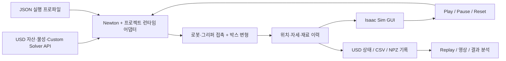

# Newton VBD Cardboard

**Newton VBD와 Isaac Sim으로 구현한 로봇의 종이박스 수직 파지·상승·소성 압착·낙하 시뮬레이션**

UR10과 Robotiq 기반 그리퍼가 테이블 위의 종이박스를 집고, 자세를 수직으로 유지한 채 200 mm 들어 올립니다. 공중에서 박스를 압착한 뒤 그리퍼를 열면 박스가 중력에 의해 테이블로 떨어집니다. 접촉에 따른 변형과 영구적인 접힘은 Newton으로 계산하고, 로봇과 박스의 상태를 Isaac Sim에 표시합니다.


*왼쪽: 로봇 전체 동작. 오른쪽: 상자와 그리퍼 확대 화면. 동일한 20초 시뮬레이션 기록을 두 시점에서 동기 재생한 Isaac Sim 렌더링입니다. Replay의 재생 속도는 실시간 물리 계산 성능을 의미하지 않습니다. [MP4 영상](docs/media/vertical-pick-replay.mp4)*

| 항목 | 구현 |
| --- | --- |
| 로봇 / 그리퍼 | UR10 / Robotiq 2F-140 기반의 2.3배 확대 가상 모델 |
| 박스 | 두께 4 mm의 균질화 쉘, 질량 약 0.2195 kg |
| 변형 계산 | Newton VBD와 rank-8 ROM의 혼합 보정 |
| 재료 모델 | 면내 탄성, 방향별 굽힘, 영구 접힘, 손상, 접힘 회전 저항 |
| 계산 / 표시 격자 | 삼각형 2,800 / 37,368 |
| 동작 | 수직 하강 → 파지 → 수직 상승 → 압착 → 개방·낙하 |
| 표시 / 조작 | Isaac Sim GUI, Play·Pause·Reset, 전체·확대 보기, 기록 재생 |
| 재사용 박스 자산 | [`assets/cardboard_simready.usda`](assets/cardboard_simready.usda), USD Custom API 7종 |
| 수직 동작 프로파일 | [`config/vertical_pick.json`](config/vertical_pick.json) |

이 저장소는 로봇과 변형체의 접촉 동작을 실행·분석하기 위한 시뮬레이션 구현을 제공합니다. 재료 계수와 확대 그리퍼는 시뮬레이션용 설정이며, 실물 골판지의 측정 물성이나 실제 장비의 하중 사양을 나타내지 않습니다.

## 목차

- [1. 시나리오](#1-시나리오)
- [2. 시스템 구성](#2-시스템-구성)
- [3. 설치](#3-설치)
- [4. 실행과 재생](#4-실행과-재생)
- [5. 설정·Custom schema·반응 튜닝](#5-설정)
- [6. 결과 파일과 영상 생성](#6-결과-파일과-영상-생성)
- [7. 저장소 구성](#7-저장소-구성)
- [8. 문제 해결](#8-문제-해결)
- [9. 적용 범위와 라이선스](#9-적용-범위와-라이선스)

## 1. 시나리오

기본 실행은 **20초의 물리 시간**으로 구성됩니다. 그리퍼는 파지부터 압착·개방까지 아래를 향한 자세를 유지하며, 상승 구간에서는 XY 위치를 유지합니다.

| 시간 | 동작 |
| --- | --- |
| 0–1초 | 초기 자세와 박스의 자중 안정화 |
| 1–3초 | 박스 위로 접근 |
| 3–5초 | 수직 하강 |
| 5–7초 | 손가락을 닫아 박스 파지 |
| 7–9초 | 수직으로 200 mm 상승 |
| 9–12초 | 공중에서 박스 압착 |
| 12–13초 | 그리퍼 개방과 자유낙하 |
| 13–20초 | 그리퍼 후퇴, 테이블 착지와 안정화 관찰 |

파지는 그리퍼와 박스 사이의 마찰 접촉으로 이루어집니다. 압착 중 발생한 소성 접힘은 하중을 제거한 뒤에도 남습니다. 로봇 관절은 역기구학으로 정한 궤적을 따르고, 박스의 변형·미끄러짐·낙하는 물리 계산 결과로 결정됩니다.

## 2. 시스템 구성



- **물리 계산:** 면내 탄성과 굽힘을 갖는 삼각형 쉘에 소성 접힘·손상·접힌 힌지의 회전 저항을 적용합니다. ROM과 VBD를 결합해 접촉과 변형을 보정합니다.
- **표시:** 계산 격자에서 더 조밀한 표시 표면을 구성해 판면과 접힘을 표현합니다. Newton worker와 Isaac Sim은 별도 Python 프로세스로 실행됩니다.
- **재생:** 저장된 정점 위치와 강체 자세를 읽어 동일한 장면을 표시합니다. Replay 중에는 물리를 다시 계산하지 않습니다.

기본 적분은 물리 프레임 60 Hz, 프레임당 16서브스텝이며 지지 상태에서는 세분화를 적용합니다. 이 값은 수치 적분 설정이며 화면 FPS나 실제 계산 속도와는 다릅니다.

### SimReady 자산과 Newton 연결

[`assets/cardboard_simready.usda`](assets/cardboard_simready.usda)는 박스를 `/Box` default prim으로 제공하는 재사용 USD 자산입니다. 단위는 미터, up axis는 Z이며 계산 격자, 표시 격자, 재질, 바인딩, 소성 상태와 솔버 설정을 함께 구성합니다. 수직 동작 장면과 같은 박스 정의를 참조하므로 두 자산의 물성과 솔버 설정이 일치합니다.

```text
/Box
├── SimMesh               계산 격자, 힌지, 소성 상태, 솔버 설정
├── RenderMesh            텍스처·UV가 있는 표시 표면과 계산 격자 바인딩
└── Materials/Cardboard   두께, 탄성, 소성, 손상, 접힘 저항
```

이 자산은 **프로젝트의 Newton 런타임에서 변형체로 실행할 수 있는 simulation-ready 자산**입니다. NVIDIA SimReady의 공식 인증을 의미하지는 않습니다. 지원 기능은 [SimReady 사양](https://docs.omniverse.nvidia.com/simready/latest/overview/simready-spec.html)의 기능별 접근에 따라 아래 USD 계약과 실행 검사로 명시합니다.

| Custom API | 적용 위치 | 역할 |
| --- | --- | --- |
| `CardboardShellAPI` | `SimMesh` | 기준 형상, 힌지, 방향별 강성, 재질·표시 격자 관계 |
| `CardboardMaterialAPI` | `Materials/Cardboard` | 두께·밀도·탄성·소성·손상·마찰 및 작은 굽힘 보강·접힘 저항 |
| `CardboardSolverAPI` | `SimMesh` | Newton ROM/VBD 구현, 반복 수, 스케줄, ROM basis와 보정 설정 |
| `CardboardPlasticStateAPI` | `SimMesh` | 소성각, 누적 소성각, 손상, 소성·접힘 저항 소산, 속도 |
| `CardboardBindingAPI` | `RenderMesh` | 계산 정점과 표시 표면의 보간 관계, 접힘 표시 |
| `CardboardDemoAPI` | 장면의 `/World/Physics` | 시간 적분, 접촉·구동 설정과 대상 관계 |
| `CardboardScenarioAPI` | 장면의 `/World/Physics` | 파지·상승·압착·개방 시간과 목표 자세 |

Custom schema는 **타입이 등록된 codeless USD API schema**이며 실행 코드는 Python/Warp로 구현합니다. [`schema.usda`](schemas/cardboard/schema.usda)가 정의 원본이고, `scripts/python.sh`가 생성된 플러그인의 등록 경로를 설정합니다.

Newton 연결은 다음 순서로 동작합니다.

1. 런타임 어댑터가 USD API 속성과 관계를 읽고 형상·재질·ROM 설정을 검증합니다. 로봇과 환경의 강체·관절·충돌은 `UsdPhysics` 정의에서 가져옵니다.
2. 박스의 기준 격자는 Newton `ModelBuilder.add_cloth_mesh`로 구성합니다. USD 힌지 순서와 재질 값을 연결하고, 프로젝트의 `AdaptiveROMVBD` 솔버와 소성 상태 갱신을 적용합니다.
3. GPU에서 계산한 정점·강체 자세를 Isaac Sim에 전달합니다. 표시 격자는 `CardboardBindingAPI`에 따라 계산 격자의 변형을 보간합니다.
4. 기록 실행은 실제 적용 설정을 `effective_scene.usda`에, 최종 형상과 재료 이력을 `final_state.usda`에 저장합니다.

박스를 다른 장면에 배치할 때에는 자산의 default prim을 `/World/Box`에 참조하고 해당 장면의 물리·시나리오 설정을 함께 구성합니다. 현재 어댑터는 박스의 이동 변환을 지원하며, 회전·스케일을 바꾸려면 기준 격자에 반영하고 바인딩·ROM을 다시 생성해야 합니다. 로봇·그리퍼 경로도 제공 장면의 구조를 따릅니다. 이 저장소의 런타임 어댑터가 Custom API를 실행하므로, 일반 USD 뷰어에서 파일을 여는 것만으로 Newton 솔버가 시작되거나 PhysX 변형체로 자동 변환되지는 않습니다. USD는 자산과 시뮬레이션 설정을 전달하고 실제 계산은 지원 런타임이 수행합니다. [SimReady 물리 구성 안내](https://docs.omniverse.nvidia.com/simready/latest/simready-asset-creation/physics-best-practices.html)

### 자산이 만들어지는 과정

표시용 3D 모델에 물리 속성과 실행 가능한 데이터 연결을 추가해 박스 자산을 구성합니다. 배포 자산은 이미 생성되어 있으므로 기본 실행에서 이 과정을 반복할 필요는 없습니다.

| 단계 | 생성 내용 | 구현 위치 |
| --- | --- | --- |
| 1. 원본 확보 | NVIDIA `cardbox_a1` USD·텍스처를 내려받고 체크섬·출처를 보존합니다. 원본 외형과 UV를 표시 표면에 사용합니다. | [`fetch_release_assets.py`](scripts/fetch_release_assets.py), [`release-inputs.lock.json`](config/release-inputs.lock.json) |
| 2. 계산 쉘 생성 | 외형에 맞는 닫힌 삼각형 중립면을 만들고 두께를 별도 물성으로 정의합니다. 현재 자산은 1,402정점·2,800삼각형입니다. | [`geometry.py`](src/cardboard/geometry.py), [`build_graded_board.py`](scripts/build_graded_board.py) |
| 3. 힌지·물성 정의 | 인접 삼각형의 4정점 힌지, 기준 이면각, 유효 폭, 방향별 굽힘 계수를 계산합니다. Newton이 구성한 힌지 순서와 일치시킵니다. | [`build_asset.py`](src/cardboard/build_asset.py), [`CardboardShellAPI`](schemas/cardboard/schema.usda) |
| 4. 표시 표면 연결 | 원본 표시 표면을 세분화하고 각 표시 정점을 계산 삼각형의 3정점·보간 가중치·오프셋으로 연결합니다. UV와 재질을 유지합니다. | [`geometry.py`](src/cardboard/geometry.py), [`surface.py`](src/cardboard/surface.py) |
| 5. 상태·솔버 부여 | 소성 상태를 0으로 초기화하고 Custom API, 재질 관계, ROM basis와 솔버 속성을 USD에 작성합니다. | [`usd_solver.py`](src/cardboard/usd_solver.py), [`vertical USD`](assets/demo_scene_robotiq_board4_vertical.usda) |
| 6. ROM 준비 | 같은 계산 격자의 물리 궤적에서 변위 증분 basis를 학습하고 형상·위상 digest를 저장합니다. 실행 중에는 이 basis로 물리 보정을 계산합니다. | [`train_rom_basis.py`](scripts/train_rom_basis.py), [`rom_basis.py`](src/cardboard/rom_basis.py) |
| 7. 패키징·검증 | `/Box` default prim, 미터·Z축, 상대 자산 경로를 제공하고 USD 구성·바인딩·ROM·GPU 실행·상태 저장을 검사합니다. | [`cardboard_simready.usda`](assets/cardboard_simready.usda), [`audit_usd_contract.py`](scripts/audit_usd_contract.py) |

`SimMesh`는 물리 계산용이고 `RenderMesh`는 표시용입니다. 표시 격자만 조밀하게 만들어도 물리 해상도가 높아지지는 않습니다. 계산 격자의 형상·정점 순서·위상을 변경하면 힌지, 기준각, 유효 폭, 상태 배열, 표시 바인딩과 ROM basis를 함께 다시 생성해야 합니다. 두께 변경도 중립면 위치·접촉 반경·질량·강성에 영향을 주므로 자산 생성 단계에서 다루는 것이 적절합니다.

### 자산 검증

```bash
# 정의 원본과 배포용 schema의 일치 확인
./scripts/python.sh scripts/generate_schemas.py --check

# 자산 구성·Custom API 등록·힌지·표시 바인딩·ROM 호환성 검사
./scripts/python.sh scripts/audit_usd_contract.py

# 완료된 20초 실행의 GPU 결과와 저장된 USD 상태 대조
./scripts/python.sh scripts/audit_usd_contract.py \
  --run-directory outputs/vertical_pick/reference \
  --report outputs/vertical_pick/usd-audit.json
```

제공된 수직 동작에 대해 전체 20초 GPU 실행을 확인했습니다. USD의 솔버 반복 수·ROM·접힘 저항이 실행 설정과 일치하며, 최종 USD의 형상·속도·소성각·누적 소성각·손상·소산 이력이 GPU 결과와 일치하는지 검사합니다. 이 검사는 구현과 데이터 연결을 검증하며 실물 재료 보정을 대신하지 않습니다.

## 3. 설치

### 실행 환경

| 구성 요소 | 확인된 구성 |
| --- | --- |
| 운영체제 | Ubuntu 24.04 LTS, x86-64 |
| 계산 환경 | Python 3.12, Newton 1.6.0, Warp 1.17.0 |
| USD | OpenUSD 25.11 |
| GPU | NVIDIA RTX 6000 Ada 48 GB |
| GUI / 렌더링 | Isaac Sim 6.0.1, 별도 Python 환경 |
| 영상 인코딩 | FFmpeg, GIF 및 H.264 지원 |

GPU 표기는 실행을 확인한 장비입니다. GUI에는 데스크톱 세션과 Vulkan/RTX 렌더링을 지원하는 드라이버가 필요합니다. 물리 계산 전용 실행에는 Isaac Sim이 필요하지 않습니다.

### 계산 환경과 자산

저장소 루트에서 실행합니다.

```bash
python3.12 -m venv .venv
.venv/bin/python -m pip install --upgrade pip
.venv/bin/python -m pip install -r requirements-lock.txt

# 공식 입력 자산 다운로드 및 체크섬 확인
python3 scripts/fetch_release_assets.py

# 공통 입력·버전·USD·ROM·CUDA 점검
./scripts/python.sh scripts/check_release.py --runtime --device cuda:0
```

자산이 이미 준비된 환경에서는 `python3 scripts/fetch_release_assets.py --offline`으로 네트워크 연결 없이 확인할 수 있습니다. 자산 출처와 체크섬은 [`config/release-inputs.lock.json`](config/release-inputs.lock.json)에 있습니다.

### Isaac Sim 환경 연결

설치된 Isaac Sim 환경의 Python 실행 파일 또는 실행 래퍼를 지정합니다.

```bash
export CARDBOARD_ISAAC_PYTHON=/absolute/path/to/isaac-python
```

별도로 설치한 계산 환경을 사용하려면 `CARDBOARD_PYTHON`에 해당 Python 경로를 지정합니다. `scripts/python.sh`는 환경 변수를 우선 사용하고, 프로젝트에 연결된 `.workspace/toolchain`이 있으면 이를 사용하며, 이후 `.venv` 또는 `.venv-gui`를 찾습니다. 계산용 패키지는 Isaac Sim 환경과 분리해 설치합니다.

## 4. 실행과 재생

### GUI 실행

```bash
# 창을 연 뒤 Play로 시작
bash scripts/live_vertical_pick.sh

# 자동 시작 및 새 디렉터리에 전체 동작 기록
bash scripts/live_vertical_pick.sh --autoplay \
  --output outputs/vertical_pick/gui01
```

| 조작 | 기능 |
| --- | --- |
| Play / Pause | 물리 계산 시작·재개 / 일시정지 |
| Reset | 초기 상태와 새 물리 worker로 재시작 |
| Overview / Box detail | 로봇 전체 보기 / 상자 확대 보기 |
| Recorded replay | 지정된 폴더의 기록 재생 |

**Box detail**은 상자를 확대하고 카메라의 회전·확대 기준점을 상자에 맞춥니다. 전체·확대 카메라 모두 near clip을 **0.01 m**로 설정해 가까운 상자 표면이 잘리는 현상을 방지합니다.

완료 후 Play를 누르면 새 동작을 시작합니다. 보관할 실행마다 새 출력 디렉터리를 사용하십시오. 동일 GUI에서 Reset을 반복하면 해당 디렉터리의 최종 기록은 마지막 실행 결과로 갱신됩니다.

### 화면 없이 계산

```bash
./scripts/run_headless.sh --profile config/vertical_pick.json \
  --device cuda:0 --output outputs/vertical_pick/reference
```

`--device`로 물리 계산 GPU를 선택합니다. GUI 표시는 GPU 0을 사용합니다. `--output`에는 아직 존재하지 않는 경로를 지정하며, 생략하면 실행별 경로가 자동 생성됩니다.

### 기록 재생

계산이 끝난 폴더를 GUI에 연결한 뒤 **Recorded replay**를 누릅니다.

```bash
bash scripts/live_vertical_pick.sh \
  --replay-directory outputs/vertical_pick/reference
```

Replay에는 같은 실행에서 생성한 `trajectory.npz`와 `state.csv`가 필요합니다. GUI 기록의 CSV는 `state-<pid>.csv`로 생성되므로, worker가 완료된 뒤 해당 파일을 같은 폴더의 `state.csv`로 복사해 사용합니다.

## 5. 설정

수직 동작은 [`config/vertical_pick.json`](config/vertical_pick.json)과 [`assets/demo_scene_robotiq_board4_vertical.usda`](assets/demo_scene_robotiq_board4_vertical.usda)로 정의합니다. 이 README의 실행 예제는 수직 동작 프로파일을 사용합니다.

| 설정 위치 | 주요 항목 |
| --- | --- |
| JSON 프로파일 | 장면, GPU, 실행 시간, 검증할 격자 사양; `solver_source: "usd"` |
| USD `/World/Box/SimMesh` | `CardboardSolverAPI`: 반복 수 24, guarded 스케줄, rank-8 ROM basis·보정 |
| USD `/World/Physics` | 동작 단계 시간, 상승 높이, 그리퍼 간격·구동력·기울기 |
| USD `/World/Box/Materials/Cardboard` | 두께, 탄성·굽힘, 소성·손상, 마찰, `cardboard:smallBend:*` |
| USD `/World/Box/RenderMesh` | 표시 표면과 접힘 보간 |

솔버와 접힘 저항의 기준값은 USD에 저장됩니다. JSON 프로파일은 이를 읽어 GUI와 headless 실행에 전달하며 같은 값을 중복 정의하지 않습니다. 작은 굽힘 보강 배율은 16, 접힘 저항 곡률은 45 m⁻¹입니다.

수직 프로파일의 파지·상승·압착·개방 기울기는 모두 `(0, 0, 0)`이며 상승 높이는 `0.2 m`입니다. 다른 동작이나 물성을 적용할 때에는 단위(`metersPerUnit = 1`)와 축(`upAxis = "Z"`)을 명시한 별도 USD 루트 레이어와 JSON 프로파일을 만들어 `--profile`로 선택할 수 있습니다. 형상·격자를 변경하면 ROM basis와의 호환성도 확인해야 합니다.

### Custom schema의 데이터 계약

아래 속성명은 모두 `cardboard:` 접두사를 사용합니다. 값은 **현재 수직 장면의 합성 결과**이며 schema fallback 기본값과 다를 수 있습니다. 재료 속성은 `/World/Box/Materials/Cardboard`, 솔버·쉘·상태 속성은 `/World/Box/SimMesh`, 표시 속성은 `/World/Box/RenderMesh`에 있습니다.

| 재료 속성 | 타입·단위 | 현재 값 | 반응에 미치는 영향 |
| --- | --- | --- | --- |
| `thickness` / `arealDensity` | float, m / kg·m⁻² | 0.004 / 0.72 | 접촉 두께·질량. 두께만 바꾸어 다른 물성이 모두 일관되게 바뀌는 것은 아닙니다. |
| `membraneShear` / `membraneArea` | float, N·m⁻¹ | 14,112 / 23,520 | 판면의 전단·면적 변형 저항 |
| `bendingMD` / `bendingCD` | float, N·m | 0.55556 / 0.27778 | 기준 두께에서 두 방향의 굽힘 강성. 현재 두께 보정 계수 0.512를 곱해 사용합니다. |
| `bendingReferenceThickness` / `bendingThicknessExponent` | float, m / 무차원 | 0.005 / 3 | 굽힘 강성 배율 `(thickness / referenceThickness)^exponent` |
| `yieldCurvature` | float, m⁻¹ | 15 | 영구 접힘이 시작되는 곡률 기준. 낮추면 더 쉽게 소성화됩니다. |
| `hardeningRatio` | float, 무차원 | 0.01 | 소성 변형 누적에 따른 경화 |
| `damageRate` / `creaseDamageLength` | float, 무차원 / m | 4 / 0.005333 | 누적 소성 곡률에 따른 국소 접힘 약화 |
| `residualStiffness` | float, 0–1 | 0.18 | 손상 후에도 남는 강성의 최소 비율 |
| `plasticityEnabled` | bool | true | 소성 갱신 활성화 |
| `friction` | float, 무차원 | 0.65 | 박스와 접촉 물체 사이의 마찰 |
| `bendingRelaxationTime` | float, s | 0.02 | 굽힘 강성에 비례한 감쇠 시간 계수 |
| `internalVelocityDamping` | float, s⁻¹ | 60 | 내부 변형 속도 감쇠. 접촉 마찰이나 영구 접힘과는 별도입니다. |
| `smallBend:scale` | double, 무차원 | 16 | 아직 접히지 않은 판의 작은 굽힘 강성 배율 |
| `smallBend:knee` / `smallBend:end` | double, m⁻¹ | 0.75 / 14.75 | 보강 구간의 전환 시작·종료 곡률 |
| `smallBend:memoryCurvature` | double, m⁻¹ | 0 | 0이면 첫 소성화 시 보강을 해제합니다. 양수이면 누적 소성 곡률에 따라 점진적으로 해제합니다. |
| `smallBend:creaseFrictionCurvature` | double, m⁻¹ | 45 | 이미 접힌 힌지의 추가 회전을 저항해 접힘 뒤의 형상 유지에 영향을 줍니다. |

작은 굽힘 보강은 `0 < scale × knee < end < yieldCurvature`를 만족해야 합니다. 예를 들어 현재 설정에서 `scale`만 크게 올리면 이 조건을 벗어날 수 있습니다. `creaseFrictionCurvature`는 힌지 강성과 유효 폭에 곱해 회전 저항 모멘트로 변환하는 모델 계수이며, 접촉면 마찰계수나 측정된 골판지 물성 자체는 아닙니다.

| 쉘·표시·상태 속성 | 타입·배열 크기 | 의미 |
| --- | --- | --- |
| `restPoints` | point3f[N], m | 기준 계산 정점; N = 1,402 |
| `hingeIndices` | int4[H] | 힌지의 양쪽 맞은편 정점과 공통 모서리 정점; H = 4,200 |
| `referenceAngles` / `dualWidths` | float[H], rad / m | 기준 이면각과 곡률 계산용 유효 폭 |
| `edgeStiffness` | float[H], N | 저장된 기준 힌지 계수. 실행 시 편집한 재질에서 방향별 값을 다시 계산합니다. |
| `materialDirection` | float3[] | 생성 단계의 재료 방향 정보. 현재 런타임 굽힘 방향 가중치는 기준 격자 모서리에서 계산합니다. |
| `material` / `renderMesh` / `simulationMesh` | relationship | 재질·계산 격자·표시 격자 연결 |
| `bindingIndices` / `bindingWeights` / `bindingOffsets` | int3[R] / float3[R] / vector3f[R] | 표시 정점별 계산 삼각형, 합이 1인 가중치, 오프셋(m) |
| `surfaceInterpolation` | token | 현재 `creaseAwareCubic`; 판면과 접힘을 표현하는 표시 보간 |
| `visualCreaseAngleDegrees` / `visualCreaseTransitionDegrees` | float, degree | 표시 표면의 접힘 강조 기준·전환 폭; 물리 강성은 바뀌지 않습니다. |
| `plasticAngles` / `accumulatedAngles` | float[H], rad | 부호 있는 영구각 / 누적 소성각 |
| `damage` | float[H], 무차원 | 힌지 손상도; 현재 상한은 `1 − residualStiffness` |
| `plasticDissipation` / `creaseFrictionWork` | float[H], J | 소성·손상 관련 소산 / 접힘 회전 저항 소산 |
| `velocities` | vector3f[N], m·s⁻¹ | 최종 계산 정점 속도 |

상태 배열은 실행 결과입니다. 반응을 튜닝할 때에는 재질·동작 속성을 수정하고 새로운 초기 상태에서 실행합니다. 최종 소성각이나 손상 배열을 임의로 편집해 원하는 형태를 만드는 방식은 사용하지 않습니다.

| `CardboardSolverAPI` 속성 (`cardboard:solver:` 뒤) | 타입·현재 값 | 역할 |
| --- | --- | --- |
| `implementation` / `schedule` | token, `adaptiveROMVBD` / `guarded` | 프로젝트 솔버와 접촉 처리 스케줄 선택 |
| `iterations` | int, 24 | 기본 반복 예산. 이 프로파일에서는 기존 Demo API의 `iterations`보다 우선합니다. |
| `romBasis` | asset, `models/board4_rank8.npz` | 속성을 작성한 USD 레이어 기준으로 해석되는 ROM 파일 경로 |
| `romTolerance` / `romFullEvery` | double / int, 1 / 2 | ROM 표현 오차 허용 기준과 전체 VBD 보정 주기 |
| `romStartWithROM` / `romCheckResidual` / `romDeferFallback` | bool, true / false / true | ROM 시작, 추가 residual 검사, 거부 보정의 예약된 VBD 처리 |
| `romElementFraction` / `romElementFullAfterYield` | double / bool, 0.25 / true | 대표 내부 요소 비율과 소성 이력 발생 후 전체 요소 사용 |
| `romLocalVBD` / `romPatchRings` | bool / int, true / 1 | 접촉·접힘 주변 국소 VBD 보정과 이웃 범위 |
| `romPatchCurvature` / `romPatchFullEvery` | double / int, 7.5 m⁻¹ / 8 | 국소 패치의 곡률 기준과 전체 보정 주기 |
| `romPatchSolver` / `romPatchRelaxation` | token / double, `jacobi` / 0.5 | 국소 보정 방식과 완화 계수 |

프로파일 실행기는 검증된 ROM 플래그 조합을 확인합니다. 재료 튜닝 중에는 솔버 설정을 고정하고, 반복 수·시간 간격을 바꾸는 검사는 별도로 수행하십시오. 반복 수나 감쇠 증가만으로 재료가 더 정확해졌다고 판단할 수는 없습니다.

### 원하는 반응에 따른 조절 방법

| 원하는 변화 | 우선 조절할 항목 | 함께 확인할 결과 |
| --- | --- | --- |
| 집기 전 판이 더 단단하게 유지됨 | `smallBend:scale`, `bendingMD/CD` | 자중 처짐, 보강 구간 조건, 파지 접촉력 |
| 더 쉽게 영구적으로 접힘 | `yieldCurvature` 감소; 보강 종료 곡률 조건 유지 | 최대·누적 소성각, 소산, 압착 후 형상 |
| 접힌 부분이 더 약해짐 | `damageRate` 증가 또는 `residualStiffness` 감소 | 손상 분포, 판 전체 붕괴 여부, 착지 후 움직임 |
| 압착 후 모양을 더 유지함 | `smallBend:creaseFrictionCurvature` 증가 | 개방 후 회복량, 추가 압착에 필요한 힘, 접힘 저항 소산 |
| 그리퍼에서 덜 미끄러짐 | `friction`, `/World/Physics`의 `graspForce`·`liftForce` | 좌우 접촉력, 상승량, 실제 미끄러짐 |
| 더 깊게 압착함 | `/World/Physics`의 `crushGap` 감소, 필요 시 `crushForce` 증가 | `actual_gap_m`, 접촉력, 영구 변형 |
| 빠른 진동을 줄임 | `bendingRelaxationTime`, 내부 속도 감쇠 | 감쇠 전후의 동작 속도·처짐·소산, 수치 안정성 |

`graspGap`, `crushGap`, `liftHeight`는 미터, `phaseEnds`는 초, `*TiltDegrees`는 도 단위입니다. 그리퍼의 `*Force`는 가상 구동기의 N 기반 명령 매개변수이며 Robotiq 어댑터가 관절 구동 참조로 변환합니다. 실제 접촉력의 상한이나 상용 장비의 정격을 뜻하지 않습니다. `crushGap` 역시 목표값이므로 결과는 CSV의 `actual_gap_m`과 접촉력으로 확인해야 합니다.

### USD 레이어로 튜닝하기

배포 자산의 체크섬을 유지하면서 값을 바꾸려면 별도 override 레이어와 프로파일을 만듭니다. 다음 예제는 **접힘 회전 저항만 45 → 60 m⁻¹**로 변경합니다.

`assets/cardboard_tuned_scene.usda`:

```usda
#usda 1.0
(
    metersPerUnit = 1
    upAxis = "Z"
    subLayers = [@demo_scene_robotiq_board4_vertical.usda@]
)
over "World"
{
    over "Box"
    {
        over "Materials"
        {
            over "Cardboard"
            {
                double cardboard:smallBend:creaseFrictionCurvature = 60
            }
        }
    }
}
```

새 프로파일을 만들고 실행합니다. 이 변경은 격자·두께를 유지하므로 기존 ROM basis와 정점 사양을 그대로 사용할 수 있습니다.

```bash
python3 - <<'PYTHON'
import json
from pathlib import Path
profile = json.loads(Path("config/vertical_pick.json").read_text())
profile.update(name="cardboard-tuned", scene="assets/cardboard_tuned_scene.usda")
Path("config/cardboard_tuned.json").write_text(json.dumps(profile, indent=2) + "\n")
PYTHON

./scripts/run_headless.sh --profile config/cardboard_tuned.json \
  --output outputs/cardboard_tuned/run01
./scripts/python.sh scripts/run_candidate.py gui \
  --profile config/cardboard_tuned.json \
  --replay-directory outputs/cardboard_tuned/run01
```

한 번에 한 종류의 계수를 바꾸고 동일한 20초 동작을 비교합니다. 파지·상승·압착·개방·착지에서 실제 간격, 접촉력, 소성각, 소산, 최종 속도를 확인하고 전체 화면과 확대 Replay를 함께 검토하십시오. 재료나 동작을 크게 변경하면 현재 ROM이 표현하는 범위를 벗어날 수 있으므로 전체 VBD 결과와 비교하고 필요한 경우 동일 격자에서 basis를 다시 학습해야 합니다.

Custom API에 새 속성을 추가할 때에는 [`schemas/cardboard/schema.usda`](schemas/cardboard/schema.usda)를 수정한 뒤 `./scripts/python.sh scripts/generate_schemas.py`로 등록 파일을 재생성합니다. 이어서 USD 작성부, 런타임에서 속성을 읽는 코드, 유효성 검사와 상태 저장을 함께 연결해야 실제 동작에 반영됩니다. 기존 GUI·worker는 재시작해 새 schema 등록을 읽도록 합니다. 새 배포를 준비할 때에는 검증 후 변경한 자산·schema의 입력 체크섬도 갱신합니다.

## 6. 결과 파일과 영상 생성

| 파일 | 내용 |
| --- | --- |
| `run_config.json` | 사용한 장면과 솔버 설정 |
| `effective_scene.usda` | 원본 장면 위에 실제 적용 물성·솔버 설정을 기록한 USD 레이어 |
| `final_state.usda` | 최종 계산·표시 형상, 강체 자세, 소성·손상·속도·소산 상태 |
| `parameters.json` | 두께 등 재료 설정 |
| `state.csv` / `state-<pid>.csv` | 시간, 접촉력, 간격, 소성·속도 등의 프레임별 값 |
| `trajectory.npz` | 재생용 정점 위치·강체 자세·시각 |
| `final_material_state.npz` | 최종 형상, 소성각, 손상, 소산 이력 |
| `performance*.json`, 로그 | 실행 성능과 진단 정보 |

`effective_scene.usda`와 `final_state.usda`는 저장소 자산을 상대 경로로 참조합니다. 공유 시 참조 자산과 디렉터리 관계를 함께 유지하십시오. 최종 USD는 표시·재료 상태 스냅샷이며 솔버 내부 승수까지 복원하는 실행 재시작 체크포인트는 아닙니다.

다음 명령은 저장된 궤적을 전체 화면과 상자 확대 화면으로 동시에 렌더링하고, 가로로 배치한 GIF와 MP4를 생성합니다. 입력 기록의 전체 시간을 재생하며 물리 계산은 다시 수행하지 않습니다.

```bash
./scripts/python.sh scripts/render_replay.py \
  --record-directory outputs/vertical_pick/reference \
  --scene assets/demo_scene_robotiq_board4_vertical.usda \
  --output outputs/vertical_pick/render01 \
  --media-prefix outputs/vertical_pick/vertical-pick-replay
```

렌더링에는 Isaac Sim이, 인코딩에는 `ffmpeg`가 필요합니다. MP4의 기본 출력은 **1200 × 522, 15 FPS**이며 `--fps`, `--width`, `--height`로 조절할 수 있습니다. `width`와 `height`는 한 화면의 크기입니다. GIF는 문서 표시용으로 가로 최대 960 px, 최대 10 FPS로 저장합니다.

## 7. 저장소 구성

```text
assets/        로봇·그리퍼·박스 USD, 재료, ROM basis
config/        실행 프로파일과 입력 자산 체크섬
src/cardboard/ 물리 모델, 솔버, 동작, 표시 표면
scripts/       설치 확인, 실행, 기록 렌더링, 분석 도구
exts/          Isaac Sim 시나리오 조작 패널
schemas/       USD 물성·동작 스키마
tests/         물리 모델과 실행 도구의 회귀 검사
docs/media/    README용 GIF·영상
third_party/   외부 코드·자산 고지
outputs/       실행별 결과와 로그
```

## 8. 문제 해결

| 증상 | 확인 사항 |
| --- | --- |
| Python 환경을 찾지 못함 | `CARDBOARD_PYTHON`, `CARDBOARD_ISAAC_PYTHON` 또는 로컬 가상환경 경로 |
| 창이 열리지 않거나 검은 화면 | 데스크톱 세션, `DISPLAY`, GPU 드라이버와 Vulkan/RTX 지원 |
| 입력 체크섬 불일치 | 해당 파일을 원본과 비교하고 올바른 자산 복구 |
| ROM / mesh 불일치 | USD의 `cardboard:solver:romBasis`와 계산 격자의 조합 |
| Custom API가 등록되지 않음 | `scripts/python.sh` 사용 여부와 `schemas/cardboard/resources` 플러그인 경로 |
| 확대 화면에서 표면이 잘림 | Box detail을 다시 선택해 카메라 위치·회전 기준점·near clip 복원 |
| Replay 기록을 찾지 못함 | 지정 폴더의 `trajectory.npz`, `state.csv`와 동작 완료 여부 |
| 기존 출력 경로 오류 | 새 디렉터리 이름을 사용하거나 `--output` 생략 |
| 처음 실행할 때 시간이 오래 걸림 | Warp 커널 및 렌더링 셰이더 초기화 진행 여부 |

문제 재현에는 사용한 프로파일, 실행 명령, 환경 버전, 해당 실행의 설정과 로그를 함께 보관하십시오.

## 9. 적용 범위와 라이선스

박스는 균질화 쉘로 모델링합니다. 골판지 내부의 flute 구조, 층간 박리, 찢어짐, 수분 의존성은 포함하지 않습니다. UR10은 규정된 IK 운동을 따르므로 실제 로봇 제어기나 토크 한계를 검증하는 용도로 사용하지 않습니다. 다른 박스·파지 조건에 적용할 때에는 재료 보정과 접촉·미끄러짐 검증이 필요합니다.

Newton에서 가져온 커널은 원저작권과 Apache-2.0 고지를 유지합니다. 로봇·박스·텍스처 자산에는 각 원본의 이용 조건이 적용됩니다. 자세한 내용은 [외부 코드·자산 고지](third_party/README.md)와 [Newton 라이선스](third_party/newton-LICENSE.md)를 참고하십시오. 프로젝트 자체 코드의 최상위 라이선스는 별도로 지정되어 있지 않습니다.
