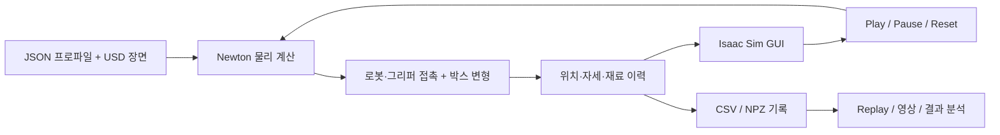

# Newton VBD Cardboard

**Newton VBD와 Isaac Sim으로 구현한 로봇의 종이박스 수직 파지·상승·소성 압착·낙하 시뮬레이션**

UR10과 Robotiq 기반 그리퍼가 테이블 위의 종이박스를 집고, 자세를 수직으로 유지한 채 200 mm 들어 올립니다. 공중에서 박스를 압착한 뒤 그리퍼를 열면 박스가 중력에 의해 테이블로 떨어집니다. 접촉에 따른 변형과 영구적인 접힘은 Newton으로 계산하고, 로봇과 박스의 상태를 Isaac Sim에 표시합니다.


*왼쪽: 로봇 전체 동작. 오른쪽: 상자와 그리퍼 확대 화면. 동일한 20초 시뮬레이션 기록을 두 시점에서 동기 재생한 Isaac Sim 렌더링입니다. Replay의 재생 속도는 실시간 물리 계산 성능을 의미하지 않습니다. [MP4 영상](docs/media/vertical-pick-replay.mp4)*

| 항목 | 구현 |
| --- | --- |
| 로봇 / 그리퍼 | UR10 / Robotiq 2F-140 기반의 2.3배 확대 가상 모델 |
| 박스 | 두께 4 mm의 균질화 쉘, 질량 약 0.2195 kg |
| 변형 계산 | Newton VBD와 rank-8 ROM의 혼합 보정 |
| 재료 모델 | 면내 탄성, 방향별 굽힘, 영구 접힘, 손상, 접힘 회전 저항 |
| 계산 / 표시 격자 | 삼각형 2,800 / 37,368 |
| 동작 | 수직 하강 → 파지 → 수직 상승 → 압착 → 개방·낙하 |
| 표시 / 조작 | Isaac Sim GUI, Play·Pause·Reset, 전체·확대 보기, 기록 재생 |
| 수직 동작 프로파일 | [`config/vertical_pick.json`](config/vertical_pick.json) |

이 저장소는 로봇과 변형체의 접촉 동작을 실행·분석하기 위한 시뮬레이션 구현을 제공합니다. 재료 계수와 확대 그리퍼는 시뮬레이션용 설정이며, 실물 골판지의 측정 물성이나 실제 장비의 하중 사양을 나타내지 않습니다.

## 목차

- [1. 시나리오](#1-시나리오)
- [2. 시스템 구성](#2-시스템-구성)
- [3. 설치](#3-설치)
- [4. 실행과 재생](#4-실행과-재생)
- [5. 설정](#5-설정)
- [6. 결과 파일과 영상 생성](#6-결과-파일과-영상-생성)
- [7. 저장소 구성](#7-저장소-구성)
- [8. 문제 해결](#8-문제-해결)
- [9. 적용 범위와 라이선스](#9-적용-범위와-라이선스)

## 1. 시나리오

기본 실행은 **20초의 물리 시간**으로 구성됩니다. 그리퍼는 파지부터 압착·개방까지 아래를 향한 자세를 유지하며, 상승 구간에서는 XY 위치를 유지합니다.

| 시간 | 동작 |
| --- | --- |
| 0–1초 | 초기 자세와 박스의 자중 안정화 |
| 1–3초 | 박스 위로 접근 |
| 3–5초 | 수직 하강 |
| 5–7초 | 손가락을 닫아 박스 파지 |
| 7–9초 | 수직으로 200 mm 상승 |
| 9–12초 | 공중에서 박스 압착 |
| 12–13초 | 그리퍼 개방과 자유낙하 |
| 13–20초 | 그리퍼 후퇴, 테이블 착지와 안정화 관찰 |

파지는 그리퍼와 박스 사이의 마찰 접촉으로 이루어집니다. 압착 중 발생한 소성 접힘은 하중을 제거한 뒤에도 남습니다. 로봇 관절은 역기구학으로 정한 궤적을 따르고, 박스의 변형·미끄러짐·낙하는 물리 계산 결과로 결정됩니다.

## 2. 시스템 구성



- **물리 계산:** 면내 탄성과 굽힘을 갖는 삼각형 쉘에 소성 접힘·손상·접힌 힌지의 회전 저항을 적용합니다. ROM과 VBD를 결합해 접촉과 변형을 보정합니다.
- **표시:** 계산 격자에서 더 조밀한 표시 표면을 구성해 판면과 접힘을 표현합니다. Newton worker와 Isaac Sim은 별도 Python 프로세스로 실행됩니다.
- **재생:** 저장된 정점 위치와 강체 자세를 읽어 동일한 장면을 표시합니다. Replay 중에는 물리를 다시 계산하지 않습니다.

기본 적분은 물리 프레임 60 Hz, 프레임당 16서브스텝이며 지지 상태에서는 세분화를 적용합니다. 이 값은 수치 적분 설정이며 화면 FPS나 실제 계산 속도와는 다릅니다.

## 3. 설치

### 실행 환경

| 구성 요소 | 확인된 구성 |
| --- | --- |
| 운영체제 | Ubuntu 24.04 LTS, x86-64 |
| 계산 환경 | Python 3.12, Newton 1.6.0, Warp 1.17.0 |
| USD | OpenUSD 25.11 |
| GPU | NVIDIA RTX 6000 Ada 48 GB |
| GUI / 렌더링 | Isaac Sim 6.0.1, 별도 Python 환경 |
| 영상 인코딩 | FFmpeg, GIF 및 H.264 지원 |

GPU 표기는 실행을 확인한 장비입니다. GUI에는 데스크톱 세션과 Vulkan/RTX 렌더링을 지원하는 드라이버가 필요합니다. 물리 계산 전용 실행에는 Isaac Sim이 필요하지 않습니다.

### 계산 환경과 자산

저장소 루트에서 실행합니다.

```bash
python3.12 -m venv .venv
.venv/bin/python -m pip install --upgrade pip
.venv/bin/python -m pip install -r requirements-lock.txt

# 공식 입력 자산 다운로드 및 체크섬 확인
python3 scripts/fetch_release_assets.py

# 공통 입력·버전·USD·ROM·CUDA 점검
./scripts/python.sh scripts/check_release.py --runtime --device cuda:0
```

자산이 이미 준비된 환경에서는 `python3 scripts/fetch_release_assets.py --offline`으로 네트워크 연결 없이 확인할 수 있습니다. 자산 출처와 체크섬은 [`config/release-inputs.lock.json`](config/release-inputs.lock.json)에 있습니다.

### Isaac Sim 환경 연결

설치된 Isaac Sim 환경의 Python 실행 파일 또는 실행 래퍼를 지정합니다.

```bash
export CARDBOARD_ISAAC_PYTHON=/absolute/path/to/isaac-python
```

별도로 설치한 계산 환경을 사용하려면 `CARDBOARD_PYTHON`에 해당 Python 경로를 지정합니다. `scripts/python.sh`는 환경 변수를 우선 사용하고, 프로젝트에 연결된 `.workspace/toolchain`이 있으면 이를 사용하며, 이후 `.venv` 또는 `.venv-gui`를 찾습니다. 계산용 패키지는 Isaac Sim 환경과 분리해 설치합니다.

## 4. 실행과 재생

### GUI 실행

```bash
# 창을 연 뒤 Play로 시작
bash scripts/live_vertical_pick.sh

# 자동 시작 및 새 디렉터리에 전체 동작 기록
bash scripts/live_vertical_pick.sh --autoplay \
  --output outputs/vertical_pick/gui01
```

| 조작 | 기능 |
| --- | --- |
| Play / Pause | 물리 계산 시작·재개 / 일시정지 |
| Reset | 초기 상태와 새 물리 worker로 재시작 |
| Scene / Box view | 로봇 전체 보기 / 상자 확대 보기 |
| Recorded replay | 지정된 폴더의 기록 재생 |

완료 후 Play를 누르면 새 동작을 시작합니다. 보관할 실행마다 새 출력 디렉터리를 사용하십시오. 동일 GUI에서 Reset을 반복하면 해당 디렉터리의 최종 기록은 마지막 실행 결과로 갱신됩니다.

### 화면 없이 계산

```bash
./scripts/run_headless.sh --profile config/vertical_pick.json \
  --device cuda:0 --output outputs/vertical_pick/reference
```

`--device`로 물리 계산 GPU를 선택합니다. GUI 표시는 GPU 0을 사용합니다. `--output`에는 아직 존재하지 않는 경로를 지정하며, 생략하면 실행별 경로가 자동 생성됩니다.

### 기록 재생

계산이 끝난 폴더를 GUI에 연결한 뒤 **Recorded replay**를 누릅니다.

```bash
bash scripts/live_vertical_pick.sh \
  --replay-directory outputs/vertical_pick/reference
```

Replay에는 같은 실행에서 생성한 `trajectory.npz`와 `state.csv`가 필요합니다. GUI 기록의 CSV는 `state-<pid>.csv`로 생성되므로, worker가 완료된 뒤 해당 파일을 같은 폴더의 `state.csv`로 복사해 사용합니다.

## 5. 설정

수직 동작은 [`config/vertical_pick.json`](config/vertical_pick.json)과 [`assets/demo_scene_robotiq_board4_vertical.usda`](assets/demo_scene_robotiq_board4_vertical.usda)로 정의합니다. 이 README의 실행 예제는 수직 동작 프로파일을 사용합니다.

| 설정 위치 | 주요 항목 |
| --- | --- |
| JSON 프로파일 | 장면, GPU, 실행 시간, 반복 수, ROM, 굽힘·접힘 저항 |
| USD `/World/Physics` | 동작 단계 시간, 상승 높이, 그리퍼 간격·구동력·기울기 |
| USD `/World/Box/Materials/Cardboard` | 두께, 탄성·굽힘, 소성·손상, 마찰 |
| USD `/World/Box/RenderMesh` | 표시 표면과 접힘 보간 |

수직 프로파일의 파지·상승·압착·개방 기울기는 모두 `(0, 0, 0)`이며 상승 높이는 `0.2 m`입니다. 다른 동작이나 물성을 적용할 때에는 별도 JSON 프로파일과 USD 레이어를 만들어 `--profile`로 선택할 수 있습니다. 형상·격자를 변경하면 ROM basis와의 호환성도 확인해야 합니다.

## 6. 결과 파일과 영상 생성

| 파일 | 내용 |
| --- | --- |
| `run_config.json` | 사용한 장면과 솔버 설정 |
| `parameters.json` | 두께 등 재료 설정 |
| `state.csv` / `state-<pid>.csv` | 시간, 접촉력, 간격, 소성·속도 등의 프레임별 값 |
| `trajectory.npz` | 재생용 정점 위치·강체 자세·시각 |
| `final_material_state.npz` | 최종 형상, 소성각, 손상, 소산 이력 |
| `performance*.json`, 로그 | 실행 성능과 진단 정보 |

다음 명령은 저장된 궤적을 전체 화면과 상자 확대 화면으로 동시에 렌더링하고, 가로로 배치한 GIF와 MP4를 생성합니다. 입력 기록의 전체 시간을 재생하며 물리 계산은 다시 수행하지 않습니다.

```bash
./scripts/python.sh scripts/render_replay.py \
  --record-directory outputs/vertical_pick/reference \
  --scene assets/demo_scene_robotiq_board4_vertical.usda \
  --output outputs/vertical_pick/render01 \
  --media-prefix outputs/vertical_pick/vertical-pick-replay
```

렌더링에는 Isaac Sim이, 인코딩에는 `ffmpeg`가 필요합니다. MP4의 기본 출력은 **1200 × 522, 15 FPS**이며 `--fps`, `--width`, `--height`로 조절할 수 있습니다. `width`와 `height`는 한 화면의 크기입니다. GIF는 문서 표시용으로 가로 최대 960 px, 최대 10 FPS로 저장합니다.

## 7. 저장소 구성

```text
assets/        로봇·그리퍼·박스 USD, 재료, ROM basis
config/        실행 프로파일과 입력 자산 체크섬
src/cardboard/ 물리 모델, 솔버, 동작, 표시 표면
scripts/       설치 확인, 실행, 기록 렌더링, 분석 도구
exts/          Isaac Sim 시나리오 조작 패널
schemas/       USD 물성·동작 스키마
tests/         물리 모델과 실행 도구의 회귀 검사
docs/media/    README용 GIF·영상
third_party/   외부 코드·자산 고지
outputs/       실행별 결과와 로그
```

## 8. 문제 해결

| 증상 | 확인 사항 |
| --- | --- |
| Python 환경을 찾지 못함 | `CARDBOARD_PYTHON`, `CARDBOARD_ISAAC_PYTHON` 또는 로컬 가상환경 경로 |
| 창이 열리지 않거나 검은 화면 | 데스크톱 세션, `DISPLAY`, GPU 드라이버와 Vulkan/RTX 지원 |
| 입력 체크섬 불일치 | 해당 파일을 원본과 비교하고 올바른 자산 복구 |
| ROM / mesh 불일치 | 프로파일이 선택한 장면과 basis의 조합 |
| Replay 기록을 찾지 못함 | 지정 폴더의 `trajectory.npz`, `state.csv`와 동작 완료 여부 |
| 기존 출력 경로 오류 | 새 디렉터리 이름을 사용하거나 `--output` 생략 |
| 처음 실행할 때 시간이 오래 걸림 | Warp 커널 및 렌더링 셰이더 초기화 진행 여부 |

문제 재현에는 사용한 프로파일, 실행 명령, 환경 버전, 해당 실행의 설정과 로그를 함께 보관하십시오.

## 9. 적용 범위와 라이선스

박스는 균질화 쉘로 모델링합니다. 골판지 내부의 flute 구조, 층간 박리, 찢어짐, 수분 의존성은 포함하지 않습니다. UR10은 규정된 IK 운동을 따르므로 실제 로봇 제어기나 토크 한계를 검증하는 용도로 사용하지 않습니다. 다른 박스·파지 조건에 적용할 때에는 재료 보정과 접촉·미끄러짐 검증이 필요합니다.

Newton에서 가져온 커널은 원저작권과 Apache-2.0 고지를 유지합니다. 로봇·박스·텍스처 자산에는 각 원본의 이용 조건이 적용됩니다. 자세한 내용은 [외부 코드·자산 고지](third_party/README.md)와 [Newton 라이선스](third_party/newton-LICENSE.md)를 참고하십시오. 프로젝트 자체 코드의 최상위 라이선스는 별도로 지정되어 있지 않습니다.
